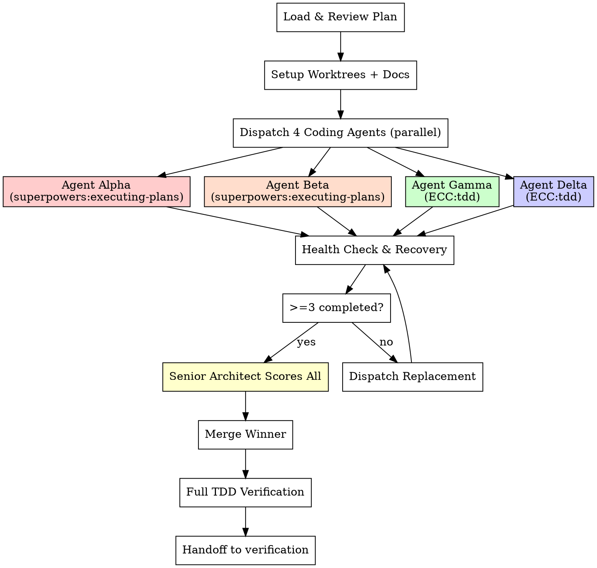

# Saturated Execution (Phase 3: execute-plan)

## Overview

**4 parallel coding agents implement the same plan independently, each with a fresh 1M context window.** Two use `superpowers:executing-plans` methodology, two use `everything-claude-code:tdd` methodology. A senior architect scores all 4, merges the best, then hands off to verification.

All agents use **opus model only**. No model downgrades. Don't be stingy with tokens.

## When to Use

- Implementation plan exists (from `/saturated-coding:write-plan` or user-provided)
- User says "execute with agent team", "饱和式执行", "saturated execute"
- After `/saturated-coding:write-plan` prompts

## The 7-Phase Process



---

## Phase 0: Load & Review Plan

1. Read the plan file (from `write-plan` output or user-provided)
2. Review critically — identify any questions or concerns
3. If concerns: raise with user before starting
4. If no concerns: proceed

**STOP if:** Plan has critical gaps, instructions unclear, missing dependency info.

---

## Phase 1: Setup

### 1.1 Create Git Worktrees

```bash
git check-ignore -q .worktrees 2>/dev/null || echo ".worktrees/" >> .gitignore
BRANCH=$(git rev-parse --abbrev-ref HEAD)
git worktree add .worktrees/sat-alpha -b sat-impl-alpha $BRANCH
git worktree add .worktrees/sat-beta -b sat-impl-beta $BRANCH
git worktree add .worktrees/sat-gamma -b sat-impl-gamma $BRANCH
git worktree add .worktrees/sat-delta -b sat-impl-delta $BRANCH
```

### 1.2 Initialize Documentation

```
claude_docs/saturation-run-{TIMESTAMP}/
├── requirements.md              # Plan + context for all agents
├── progress.md                  # Overall progress tracker
├── agent-alpha/
│   └── implementation.md        # Alpha's approach, TDD log
├── agent-beta/
│   └── implementation.md        # Beta's approach, TDD log
├── agent-gamma/
│   └── implementation.md        # Gamma's approach, TDD log
├── agent-delta/
│   └── implementation.md        # Delta's approach, TDD log
└── architect-review.md          # Comparative analysis
```

---

## Phase 2: Dispatch 4 Coding Agents (PARALLEL)

Dispatch ALL 4 agents simultaneously. Each gets the FULL plan and a fresh 1M context window.

### Agent Alpha — superpowers:executing-plans (plan-faithful)

```python
Agent(
    description="Agent Alpha: superpowers executing-plans",
    prompt="""
    You are Agent Alpha (1 of 4 independent coding agents) in a Saturated Coding team.
    Your implementation will be scored against 3 others. Write the BEST code you can.

    ## Methodology: superpowers:executing-plans
    Follow the executing-plans approach strictly:
    1. Load and review the plan critically
    2. Execute each task in order, following EVERY step exactly
    3. For each task: read step -> execute step -> verify step -> commit
    4. Never skip verification steps
    5. Stop when blocked, don't guess

    ## The Plan
    {FULL_PLAN}

    ## Codebase Context
    {RELEVANT_CONTEXT}

    ## Rules (NON-NEGOTIABLE)
    1. Follow TDD: test FIRST, verify FAIL, implement, verify PASS, commit
    2. You are in an isolated worktree — work independently
    3. Do NOT look at other agents' work
    4. Document your approach in: claude_docs/saturation-run-{TIMESTAMP}/agent-alpha/implementation.md
    5. Include TDD log, design decisions, test summary, self-assessment (1-10)
    6. Commit all work with descriptive messages
    7. Functions < 50 lines, Files < 800 lines
    8. Immutable data patterns preferred

    ## Evaluation (100 points)
    | Correctness (30) | Code Quality (25) | Test Coverage (20) | Performance (10) | Security (10) | Simplicity (5) |
    """,
    isolation="worktree",
    run_in_background=True,
    model="opus"
)
```

### Agent Beta — superpowers:executing-plans (creative interpretation)

```python
Agent(
    description="Agent Beta: superpowers executing-plans creative",
    prompt="""
    You are Agent Beta (1 of 4 independent coding agents) in a Saturated Coding team.
    Your implementation will be scored against 3 others. Write the BEST code you can.

    ## Methodology: superpowers:executing-plans (creative interpretation)
    Follow executing-plans but optimize for:
    - Better architecture: if the plan's structure could be cleaner, improve it
    - Better error handling: add comprehensive error handling beyond what the plan specifies
    - Better naming: use the most descriptive names possible
    - Still follow TDD strictly

    ## The Plan
    {FULL_PLAN}

    ## Codebase Context
    {RELEVANT_CONTEXT}

    ## Rules (NON-NEGOTIABLE)
    1. Follow TDD: test FIRST, verify FAIL, implement, verify PASS, commit
    2. You are in an isolated worktree — work independently
    3. Do NOT look at other agents' work
    4. Document your approach in: claude_docs/saturation-run-{TIMESTAMP}/agent-beta/implementation.md
    5. Include TDD log, design decisions, test summary, self-assessment (1-10)
    6. Commit all work with descriptive messages

    ## Evaluation (100 points)
    | Correctness (30) | Code Quality (25) | Test Coverage (20) | Performance (10) | Security (10) | Simplicity (5) |
    """,
    isolation="worktree",
    run_in_background=True,
    model="opus"
)
```

### Agent Gamma — everything-claude-code:tdd (strict TDD)

```python
Agent(
    description="Agent Gamma: ECC TDD strict mode",
    prompt="""
    You are Agent Gamma (1 of 4 independent coding agents) in a Saturated Coding team.
    Your implementation will be scored against 3 others. Write the BEST code you can.

    ## Methodology: everything-claude-code:tdd (strict TDD workflow)
    Follow the TDD workflow skill strictly:
    1. Write user journeys first
    2. Generate comprehensive test cases from journeys
    3. Run tests — they MUST fail (RED)
    4. Write MINIMAL code to pass (GREEN)
    5. Refactor while keeping tests green (REFACTOR)
    6. Verify 80%+ coverage
    7. Include unit tests, integration tests, and edge case tests

    Key principles:
    - Tests BEFORE code, always
    - One assert per test (focused tests)
    - Test behavior, not implementation
    - Arrange-Act-Assert structure
    - Mock external dependencies only
    - Clean up after tests (no side effects)

    ## The Plan
    {FULL_PLAN}

    ## Codebase Context
    {RELEVANT_CONTEXT}

    ## Rules (NON-NEGOTIABLE)
    1. TDD is MANDATORY — NO production code without a failing test first
    2. If you write code before a test: DELETE IT and start over
    3. You are in an isolated worktree — work independently
    4. Do NOT look at other agents' work
    5. Document your approach in: claude_docs/saturation-run-{TIMESTAMP}/agent-gamma/implementation.md
    6. Include full TDD log (RED-GREEN-REFACTOR for each cycle)
    7. Include coverage report
    8. Self-assessment (1-10)

    ## Evaluation (100 points)
    | Correctness (30) | Code Quality (25) | Test Coverage (20) | Performance (10) | Security (10) | Simplicity (5) |
    """,
    isolation="worktree",
    run_in_background=True,
    model="opus"
)
```

### Agent Delta — everything-claude-code:tdd (defensive coding)

```python
Agent(
    description="Agent Delta: ECC TDD defensive coding",
    prompt="""
    You are Agent Delta (1 of 4 independent coding agents) in a Saturated Coding team.
    Your implementation will be scored against 3 others. Write the BEST code you can.

    ## Methodology: everything-claude-code:tdd (defensive coding)
    Follow TDD workflow with emphasis on:
    - Extensive edge case testing (null, empty, boundary, overflow, unicode)
    - Defensive input validation at EVERY system boundary
    - Error handling for EVERY failure mode
    - Security-first: validate all inputs, sanitize all outputs
    - Performance tests for hot paths

    TDD cycle: User journeys -> Test cases -> RED -> GREEN -> REFACTOR -> Coverage check

    ## The Plan
    {FULL_PLAN}

    ## Codebase Context
    {RELEVANT_CONTEXT}

    ## Rules (NON-NEGOTIABLE)
    1. TDD is MANDATORY — write tests FIRST
    2. Focus on edge cases and error paths
    3. You are in an isolated worktree — work independently
    4. Do NOT look at other agents' work
    5. Document your approach in: claude_docs/saturation-run-{TIMESTAMP}/agent-delta/implementation.md
    6. Include TDD log, edge case inventory, security considerations
    7. Self-assessment (1-10)

    ## Evaluation (100 points)
    | Correctness (30) | Code Quality (25) | Test Coverage (20) | Performance (10) | Security (10) | Simplicity (5) |
    """,
    isolation="worktree",
    run_in_background=True,
    model="opus"
)
```

---

## Phase 2.5: Health Check & Recovery (MANDATORY)

After all 4 agents complete, verify EACH:

- [ ] Agent returned a result (no error/timeout)
- [ ] Agent has git commits on its branch (`git log sat-impl-{name} --oneline`)
- [ ] Documentation file exists with TDD log entries
- [ ] Self-assessment score (1-10) is present
- [ ] Tests exist and were run

### Recovery Protocol

| Failure | Action |
|---------|--------|
| Agent errored | Dispatch replacement in new worktree branch. Max 1 retry per slot. |
| No commits | Same as error — dispatch replacement. |
| Commits but no tests | Resume agent: "You MUST write tests. Your work is incomplete." |
| Incomplete output | Resume agent to finish. If not resumable, dispatch replacement. |
| 2+ agents failed | Dispatch replacements in parallel. Last retry round. |
| All 4 failed | STOP. Report to user. |

**Minimum:** 3 of 4 agents completed to proceed.

---

## Phase 3: Senior Architect Review

Dispatch architect agent using `./architect-review-template.md`.

### Scoring Rubric (100 points)

| Criterion | Weight | Measures |
|-----------|--------|----------|
| Correctness | 30% | Tests pass, spec compliance, edge cases |
| Code Quality | 25% | Clean, readable, well-structured |
| Test Coverage | 20% | Coverage %, TDD evidence, test quality |
| Performance | 10% | Efficient algorithms, data structures |
| Security | 10% | No vulnerabilities, input validation |
| Simplicity | 5% | YAGNI, minimal abstractions |

### Selection (see `./merge-strategy.md`)

| Scenario | Action |
|----------|--------|
| Clear winner (>10 pt lead) | Merge as-is |
| Close race (<10 pt gap) | Maintainability tiebreaker |
| All <60 | Reject all, re-examine plan |
| Tie across methodologies | Prefer superpowers agents (better plan adherence) |

Save review to: `claude_docs/saturation-run-{TIMESTAMP}/architect-review.md`

---

## Phase 4: Merge Winner

```bash
git checkout -b sat-integration $BRANCH
git merge sat-impl-{winner} --no-ff -m "feat: merge {winner} ({score}/100)"
```

---

## Phase 5: Full TDD Verification on Merged Code

```bash
# Run project-appropriate test command
pytest --cov --cov-report=term-missing  # Python
# npm test -- --coverage                # Node
# go test ./... -cover                  # Go
```

ALL tests must pass. Coverage >= 80% on new code.

If tests fail: fix before proceeding. Use `everything-claude-code:build-error-resolver` if needed.

---

## Phase 6: Automatic Handoff to Verification

After merge verification passes:

```
Execution complete. Winner: {name} ({score}/100)
Merged to sat-integration branch.
All tests pass. Coverage: {X}%.

Proceeding to cross-verification...
→ /saturated-coding:verification
```

The orchestrator automatically proceeds to the verification phase.

---

## Phase 7: Cleanup (after verification passes)

```bash
# Remove worktrees
git worktree remove .worktrees/sat-alpha 2>/dev/null
git worktree remove .worktrees/sat-beta 2>/dev/null
git worktree remove .worktrees/sat-gamma 2>/dev/null
git worktree remove .worktrees/sat-delta 2>/dev/null

# Delete implementation branches
git branch -D sat-impl-alpha sat-impl-beta sat-impl-gamma sat-impl-delta
```

---

## Documentation Output

```
claude_docs/saturation-run-{TIMESTAMP}/
├── requirements.md              # Plan + context
├── progress.md                  # Progress tracker
├── agent-alpha/implementation.md
├── agent-beta/implementation.md
├── agent-gamma/implementation.md
├── agent-delta/implementation.md
└── architect-review.md          # Scoring & selection
```

---

## Red Flags — STOP

- Agent completed without tests -> Disqualify
- All 4 scored below 60 -> Re-examine plan
- Merge creates test failures -> Fix before proceeding
- Agent didn't write docs -> Resume and require
