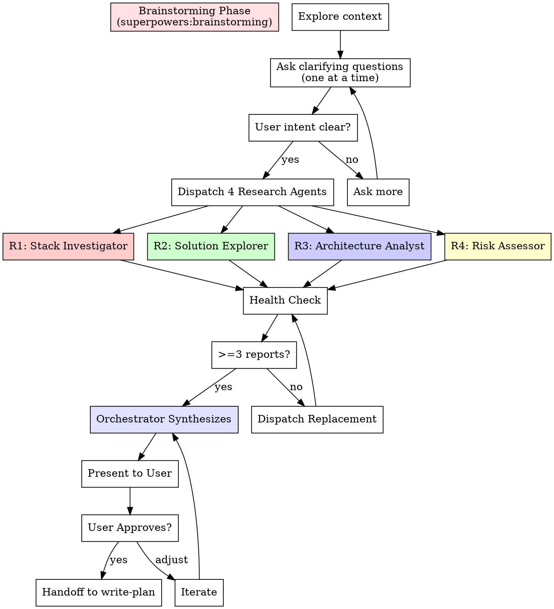

# Saturated Research (Phase 1)

## Overview

**Inherits from `superpowers:brainstorming` and amplifies it with 4 parallel research agents.** Instead of one brainstorming pass, dispatch 4 independent researchers — each investigating a different dimension of the problem — then synthesize their findings into a comprehensive research document.

The orchestrator (YOU) follows the `superpowers:brainstorming` checklist first (explore context, ask clarifying questions one at a time, understand intent), then spawns 4 parallel research agents for deep investigation.

## When to Use

- Starting a new feature or project
- User says "saturated coding", "brainstorm", "研究一下"
- Need comprehensive understanding before planning
- Complex problem needing multi-angle investigation

## The Process



---

## Phase 1: Brainstorming Foundation

Follow `superpowers:brainstorming` checklist:

1. **Explore project context** — check files, docs, recent commits
2. **Ask clarifying questions** — one at a time, understand purpose/constraints/success criteria
3. **Understand the full picture** before dispatching agents

**HARD GATE:** Do NOT dispatch research agents until you understand what the user wants to build.

---

## Phase 2: Dispatch 4 Research Agents (PARALLEL)

Once requirements are clear, dispatch ALL 4 agents simultaneously in the background.

### Agent R1: Stack Investigator

```python
Agent(
    description="Research: stack features investigation",
    prompt="""
    You are Research Agent R1: Stack Investigator.

    ## Task
    {REQUIREMENTS}

    ## Codebase Context
    {CONTEXT}

    ## Your Focus: Stack Features
    Investigate the technology stack relevant to this task:
    - What existing libraries/frameworks solve parts of this problem?
    - What are the key APIs/interfaces we should use?
    - What version constraints or compatibility issues exist?
    - What patterns does this stack encourage?
    - Search for battle-tested implementations (gh search, package registries)
    - Evaluate 2-3 candidate libraries if applicable

    ## Output
    Write your research report to: claude_docs/saturation-run-{TIMESTAMP}/research-agent-1-stack.md

    Include: findings, recommendations, links to relevant docs/repos, pros/cons of options.
    """,
    run_in_background=True,
    model="opus"
)
```

### Agent R2: Solution Explorer

```python
Agent(
    description="Research: existing solutions exploration",
    prompt="""
    You are Research Agent R2: Solution Explorer.

    ## Task
    {REQUIREMENTS}

    ## Codebase Context
    {CONTEXT}

    ## Your Focus: Existing Solutions
    Find existing implementations and prior art:
    - Search GitHub for similar projects (gh search repos, gh search code)
    - Look for open-source projects that solve 80%+ of the problem
    - Find adaptable implementations that can be ported or wrapped
    - Identify design patterns used in successful similar projects
    - Propose 2-3 concrete solution approaches with trade-offs

    ## Output
    Write your research report to: claude_docs/saturation-run-{TIMESTAMP}/research-agent-2-solutions.md

    Include: links to repos, code snippets, approach comparison matrix.
    """,
    run_in_background=True,
    model="opus"
)
```

### Agent R3: Architecture Analyst

```python
Agent(
    description="Research: architecture analysis",
    prompt="""
    You are Research Agent R3: Architecture Analyst.

    ## Task
    {REQUIREMENTS}

    ## Codebase Context
    {CONTEXT}

    ## Your Focus: Architecture & Design
    Analyze the architecture implications:
    - How does this fit into the existing codebase architecture?
    - What modules/files need to change?
    - What interfaces/contracts need to be defined?
    - What are the data flow patterns?
    - How should components be decomposed for testability?
    - Propose file structure and module boundaries

    ## Output
    Write your research report to: claude_docs/saturation-run-{TIMESTAMP}/research-agent-3-architecture.md

    Include: architecture diagram (text), file structure, interface definitions, data flow.
    """,
    run_in_background=True,
    model="opus"
)
```

### Agent R4: Risk Assessor

```python
Agent(
    description="Research: risk assessment",
    prompt="""
    You are Research Agent R4: Risk Assessor.

    ## Task
    {REQUIREMENTS}

    ## Codebase Context
    {CONTEXT}

    ## Your Focus: Risks & Constraints
    Identify risks, constraints, and edge cases:
    - What could go wrong? (technical, security, performance)
    - What are the dependencies and their failure modes?
    - What edge cases must be handled?
    - What are the security implications? (OWASP Top 10)
    - What performance constraints exist?
    - What backward compatibility concerns exist?
    - Propose mitigation strategies for each risk

    ## Output
    Write your research report to: claude_docs/saturation-run-{TIMESTAMP}/research-agent-4-risks.md

    Include: risk matrix (likelihood x impact), mitigation strategies, security checklist.
    """,
    run_in_background=True,
    model="opus"
)
```

---

## Phase 2.5: Health Check (MANDATORY)

After all 4 agents complete, verify each:

- [ ] Agent returned a result (no error/timeout)
- [ ] Report file exists and is non-empty
- [ ] Report contains substantive content (> 300 words)
- [ ] Report addresses the assigned focus area

### Recovery

| Failure | Action |
|---------|--------|
| Agent errored | Dispatch replacement. Max 1 retry per slot. |
| Report empty/missing | Dispatch replacement. |
| Report off-topic | Resume agent with correction. |
| 2+ agents failed | Dispatch replacements in parallel. |
| All 4 failed | STOP. Report to user. |

**Minimum:** 3 of 4 reports to proceed.

---

## Phase 3: Orchestrator Synthesis

Read ALL research reports and synthesize into a unified document:

### 3.1 Integration

```markdown
# Research Synthesis: {Feature Name}
**Date:** YYYY-MM-DD
**Agents:** 4 (Stack, Solutions, Architecture, Risks)

## Executive Summary
{2-3 sentences capturing the key findings across all 4 reports}

## Stack Recommendations
{From R1: recommended libraries, frameworks, APIs}

## Solution Approaches
{From R2: top 2-3 approaches with pros/cons}
| Approach | Pros | Cons | Effort | Recommended? |
|----------|------|------|--------|-------------|

## Architecture Design
{From R3: proposed architecture, file structure, interfaces}

## Risk Matrix
{From R4: risks with mitigation}
| Risk | Likelihood | Impact | Mitigation |
|------|-----------|--------|------------|

## Recommended Approach
{Orchestrator's synthesis: which approach, which architecture, how to mitigate risks}

## Open Questions
{Anything that needs user input before planning}
```

Save to: `claude_docs/saturation-run-{TIMESTAMP}/research-context.md`

### 3.2 Present to User

Present the synthesis and ask:
- Does this match your vision?
- Any concerns with the recommended approach?
- Ready to proceed to planning?

### 3.3 Handoff

When user approves:

```
Research complete. Ready to create implementation plans with 4 parallel planning agents?
→ /saturated-coding:write-plan
```
