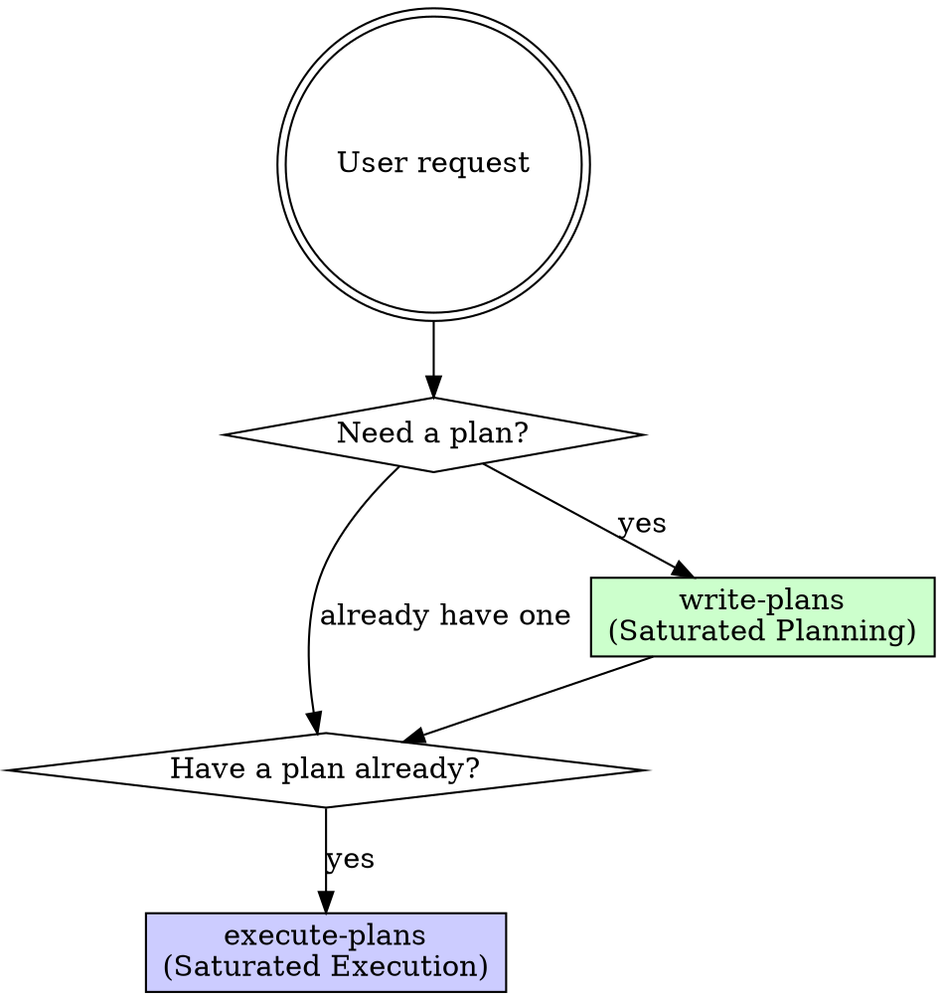

# Saturated Agent Team Coding (饱和式编程)

## Overview

**Ensemble methods applied to the FULL software lifecycle.** Two sub-workflows that apply multi-agent redundancy at every stage — from planning to implementation to review.

**Core principle:** Redundancy eliminates blind spots. Multiple independent agents rarely make the same mistake. The best outcome emerges from competition, not from a single attempt.

## Sub-Workflows



### 1. `write-plans` — Saturated Planning

**When:** Requirements exist but no implementation plan yet.

Dispatches 2+ parallel planning agents (using `everything-claude-code:plan` + `superpowers:writing-plans`), each independently generates a complete implementation plan. The orchestrator then reviews, compares, and merges them into a superior final plan.

**Full workflow:** See `./write-plans.md`

### 2. `execute-plans` — Saturated Execution

**When:** An implementation plan exists and needs to be executed.

Dispatches 3 parallel coding agents in isolated git worktrees, each independently implements with TDD. A senior architect scores all 3, merges the best, then auto-codex-review validates before shipping.

**Full workflow:** See `./execute-plans.md`

## Typical Full Pipeline

```
User requirement
    ↓
[write-plans] → 2+ agents generate plans in parallel
    ↓              → Orchestrator reviews & merges → Final plan
    ↓
[execute-plans] → 3 agents implement in parallel (TDD)
    ↓               → Architect scores & merges best code
    ↓               → TDD verification on merged code
    ↓               → Auto-codex cross-review
    ↓               → Documentation + git push
    ↓
Shipped!
```

## Quick Invocation

```
# Full pipeline (plan then execute)
/saturated-agent-team-coding

# Plan only (directly invocable sub-skill)
/saturated-agent-team-coding:write-plans

# Execute only (directly invocable sub-skill, when plan already exists)
/saturated-agent-team-coding:execute-plans
```

## Documentation Convention

ALL agents write docs to `claude_docs/saturation-run-YYYY-MM-DD-HHMM/`. This is non-negotiable. The docs are the shared memory across agents and sessions.
