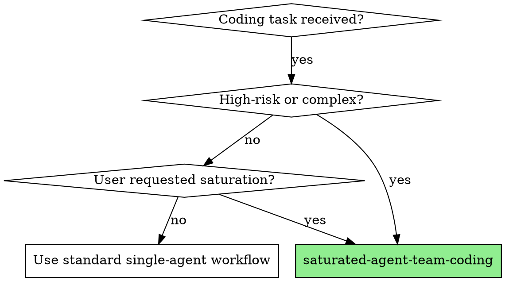
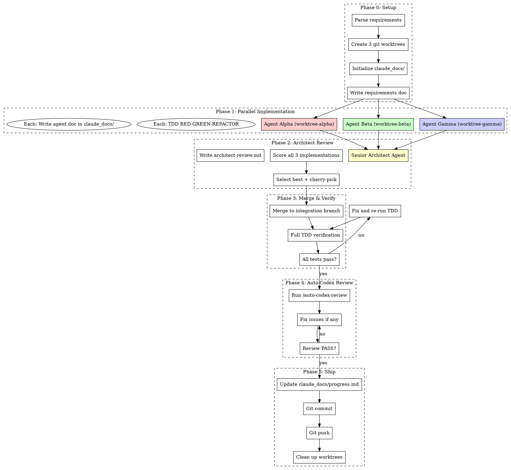

# Saturated Agent Team Coding (饱和式编程)

## Overview

**Ensemble methods applied to software engineering.** Spawn 3 independent coding agents to implement the same requirement in isolated git worktrees with TDD. A senior architect compares all implementations, scores them on an objective rubric, and merges the best code. The merged result goes through TDD verification and auto-codex-review before shipping.

**Core principle:** Redundancy eliminates blind spots. Three independent implementations rarely make the same mistake. The best code emerges from competition, not from a single attempt.

**Inspired by:** ChatDev/MetaGPT multi-agent patterns, ensemble code generation (best-of-N), tournament selection from genetic algorithms, and competitive programming.

## When to Use



**Use when:**
- Feature implementation requiring high confidence
- Bug fixes in critical paths
- Any coding task where user explicitly requests agent team / saturation
- Core algorithm implementations
- Security-sensitive code changes
- Code that touches production deployment

**Don't use when:**
- Simple config changes or typo fixes
- Documentation-only changes
- Exploratory prototyping (throw-away code)
- Tasks with heavy sequential dependencies that can't be parallelized

## The Complete Process (6 Phases)



---

## Phase 0: Setup & Requirements Distribution

### 0.1 Parse Requirements

Extract from the user's request:
- **What** to build (functional requirements)
- **Constraints** (performance, security, compatibility)
- **Test criteria** (how to verify success)
- **Existing code context** (files to modify, APIs to use)

### 0.2 Create Git Worktrees

```bash
# Ensure worktree directory is gitignored
git check-ignore -q .worktrees 2>/dev/null || echo ".worktrees/" >> .gitignore

# Create 3 isolated worktrees from current branch
BRANCH=$(git rev-parse --abbrev-ref HEAD)
git worktree add .worktrees/sat-alpha -b sat-impl-alpha $BRANCH
git worktree add .worktrees/sat-beta -b sat-impl-beta $BRANCH
git worktree add .worktrees/sat-gamma -b sat-impl-gamma $BRANCH
```

**CRITICAL:** Each worktree gets its own branch. Agents NEVER share a branch.

### 0.3 Initialize Documentation

Create `claude_docs/saturation-run-<YYYY-MM-DD-HHMM>/` with:

```
claude_docs/saturation-run-<timestamp>/
├── requirements.md          # Full requirements for all agents
├── progress.md              # Overall progress tracker
├── agent-alpha/
│   └── implementation.md    # Alpha's approach, decisions, TDD log
├── agent-beta/
│   └── implementation.md    # Beta's approach, decisions, TDD log
├── agent-gamma/
│   └── implementation.md    # Gamma's approach, decisions, TDD log
├── architect-review.md      # Architect's comparative analysis
└── final-review.md          # Auto-codex review results
```

### 0.4 Write Requirements Document

Write `requirements.md` containing:
- Full specification (copy from user's request)
- Relevant existing code context (key file contents, APIs)
- Test requirements (what tests must pass)
- Constraints and non-functional requirements
- **Explicitly state:** "You are one of 3 independent agents. Implement this YOUR way. Do NOT try to coordinate with other agents."

---

## Phase 1: Parallel Implementation

**Dispatch 3 agents IN PARALLEL using the Agent tool with `isolation: "worktree"`.**

Each agent receives:
1. The full requirements document
2. A unique identity (Alpha/Beta/Gamma)
3. TDD instructions (mandatory RED-GREEN-REFACTOR)
4. Documentation instructions (write to their `claude_docs/agent-{name}/implementation.md`)

### Agent Prompt Template

Use `./agent-prompt-template.md` for the full prompt. Key elements:

```markdown
You are Agent {ALPHA|BETA|GAMMA} in a saturated coding team.

## Your Task
{FULL REQUIREMENTS}

## Rules
1. Follow TDD strictly: Write test FIRST → watch it FAIL → write minimal code → watch it PASS → refactor
2. Work independently. Do NOT look at other agents' code.
3. Document your approach in claude_docs/saturation-run-{TIMESTAMP}/agent-{NAME}/implementation.md
4. Commit your work with descriptive messages.
5. Your implementation will be scored against two other independent implementations.

## Documentation Template
Write to implementation.md:
- Approach chosen and why
- TDD log (each RED-GREEN-REFACTOR cycle)
- Design decisions and trade-offs
- Test coverage summary
- Known limitations
- Self-assessment score (1-10) with justification
```

### Parallel Dispatch

```python
# Pseudocode for orchestrator
Agent(
    description="Agent Alpha implements feature",
    prompt=AGENT_PROMPT.format(NAME="alpha", REQUIREMENTS=req),
    isolation="worktree",
    mode="bypassPermissions",
    run_in_background=True
)
Agent(
    description="Agent Beta implements feature",
    prompt=AGENT_PROMPT.format(NAME="beta", REQUIREMENTS=req),
    isolation="worktree",
    mode="bypassPermissions",
    run_in_background=True
)
Agent(
    description="Agent Gamma implements feature",
    prompt=AGENT_PROMPT.format(NAME="gamma", REQUIREMENTS=req),
    isolation="worktree",
    mode="bypassPermissions",
    run_in_background=True
)
# Wait for all 3 to complete
```

### Quality Gate: Each Agent Must

- [ ] Write tests FIRST (TDD Iron Law)
- [ ] All tests pass
- [ ] Code committed to their branch
- [ ] Documentation written in `claude_docs/`
- [ ] Self-assessment score provided

**If an agent fails TDD or tests don't pass:** That implementation is disqualified from the tournament.

---

## Phase 2: Senior Architect Review

### 2.1 Dispatch Architect Agent

After all 3 coding agents complete, dispatch a **Senior Architect Agent** (use `model: "opus"` for deepest reasoning) that:

1. Reads ALL 3 implementations
2. Reads ALL 3 agent documentation files
3. Scores each on the rubric (see `./architect-review-template.md`)
4. Writes comparative analysis to `architect-review.md`
5. Selects the winning approach (or hybrid merge if justified)

### 2.2 Scoring Rubric (Objective Metrics)

| Criterion | Weight | How to Measure |
|-----------|--------|----------------|
| **Correctness** | 30% | All tests pass, edge cases handled, spec compliance |
| **Code Quality** | 25% | Cyclomatic complexity, function length (<50 lines), file size (<800 lines), naming, readability |
| **Test Coverage** | 20% | Line/branch coverage %, test quality (tests real behavior, not mocks) |
| **Performance** | 10% | Algorithmic complexity, unnecessary allocations, efficient data structures |
| **Security** | 10% | No injection vectors, input validation, no hardcoded secrets |
| **Simplicity** | 5% | YAGNI compliance, minimal abstraction, no over-engineering |

**Total Score = Σ(criterion × weight)**

### 2.3 Selection Strategy

See `./merge-strategy.md` for full details. Summary:

| Scenario | Action |
|----------|--------|
| **Clear winner** (>10 point lead) | Merge winner as-is |
| **Close race** (<10 point gap, top 2) | Architect picks based on maintainability tiebreaker |
| **All weak** (all <60 points) | Reject all, re-run with refined requirements |
| **Hybrid opportunity** | RARE: Only if implementations solve different sub-problems cleanly |

### 2.4 Architect Review Document

The architect writes `architect-review.md`:

```markdown
# Architect Review: {Feature Name}

## Scores

| Agent | Correctness | Quality | Tests | Perf | Security | Simplicity | **Total** |
|-------|-------------|---------|-------|------|----------|------------|-----------|
| Alpha | 28/30 | 22/25 | 18/20 | 8/10 | 9/10 | 4/5 | **89** |
| Beta  | 25/30 | 20/25 | 16/20 | 9/10 | 8/10 | 5/5 | **83** |
| Gamma | 30/30 | 18/25 | 20/20 | 7/10 | 10/10 | 3/5 | **88** |

## Analysis
- Alpha: Best overall balance. Clean code, good tests.
- Beta: Most performant but weaker tests.
- Gamma: Perfect correctness and security but over-engineered.

## Decision: **Alpha** (merge as-is)
Rationale: Highest total score with best quality-coverage balance.

## Cherry-pick from others
- None needed. Alpha's implementation is comprehensive.
```

---

## Phase 3: Merge & TDD Verification

### 3.1 Merge Winning Code

```bash
# Create integration branch from current main
git checkout -b sat-integration $BRANCH

# Merge winner
git merge sat-impl-alpha --no-ff -m "feat: merge Alpha's implementation (scored 89/100)"

# If hybrid merge needed (rare):
# git cherry-pick <specific-commits-from-other-agents>
```

### 3.2 Full TDD Verification

Run the COMPLETE test suite on the merged code:

```bash
# Run all existing tests + new tests from winning agent
pytest --cov --cov-report=term-missing  # Python
# or
npm test -- --coverage                   # Node.js
```

**MANDATORY:** All tests must pass. If ANY test fails:
1. Fix the issue
2. Re-run tests
3. Repeat until green

### 3.3 Coverage Check

Verify 80%+ test coverage on new code. If below threshold:
1. Identify uncovered lines
2. Write additional tests (following TDD)
3. Re-verify coverage

---

## Phase 4: Auto-Codex Review

**REQUIRED SUB-SKILL:** Use `auto-codex-review` skill.

Invoke the auto-codex-review loop on the merged code:

1. Collect all changed files (git diff against base branch)
2. Run Codex review (structured JSON)
3. Fix P0/P1 issues
4. Re-review until PASS (max 5 rounds)
5. Generate review summary in `claude_docs/saturation-run-{TIMESTAMP}/final-review.md`

**If auto-codex-review is not available** (no Codex MCP), fall back to:
1. Dispatch a `code-reviewer` agent for quality review
2. Dispatch a `security-reviewer` agent for security review
3. Fix all CRITICAL and HIGH issues
4. Re-review until clean

---

## Phase 5: Documentation & Ship

### 5.1 Update Progress Document

Write final `progress.md`:

```markdown
# Saturation Run: {Feature Name}
**Date:** YYYY-MM-DD
**Status:** COMPLETE

## Results
- Agents dispatched: 3 (Alpha, Beta, Gamma)
- Winner: Alpha (89/100)
- Runner-up: Gamma (88/100)
- Auto-codex rounds: 2 (7 issues fixed)
- Final test coverage: 94%

## Files Modified
- path/to/file1.py (new)
- path/to/file2.py (modified)

## Approach
Alpha used {approach description}...

## Lessons Learned
- {What worked well}
- {What could improve next time}
```

### 5.2 Git Commit

```bash
git add -A
git commit -m "feat: {description} (saturated-team, best-of-3, score 89/100)

Agents: Alpha (89), Beta (83), Gamma (88)
Winner: Alpha - {brief rationale}
Auto-codex: PASS (2 rounds, 7 issues fixed)
Coverage: 94%

Co-Authored-By: Claude Opus 4.6 <noreply@anthropic.com>"
```

### 5.3 Git Push

```bash
git push origin sat-integration
# Or merge to main and push, depending on workflow
```

### 5.4 Clean Up

```bash
# Remove worktrees
git worktree remove .worktrees/sat-alpha
git worktree remove .worktrees/sat-beta
git worktree remove .worktrees/sat-gamma

# Delete branches
git branch -D sat-impl-alpha sat-impl-beta sat-impl-gamma
```

---

## Quick Reference

| Phase | Who | Duration | Output |
|-------|-----|----------|--------|
| 0: Setup | Orchestrator | ~2 min | Worktrees + docs structure |
| 1: Parallel Impl | 3 Agents | ~10-30 min (parallel) | 3 implementations + docs |
| 2: Architect Review | Architect Agent | ~5 min | Scores + selection |
| 3: Merge & Verify | Orchestrator | ~5 min | Merged + tested code |
| 4: Auto-Codex Review | Codex/Reviewer | ~5-10 min | Clean code |
| 5: Ship | Orchestrator | ~2 min | Committed + pushed |

## Documentation Convention

**Every agent writes docs.** This is non-negotiable. The `claude_docs/` directory is the shared memory that allows any agent (or human) to understand the full history at any time.

**File naming:** `claude_docs/saturation-run-YYYY-MM-DD-HHMM/`

**Required docs per run:**
1. `requirements.md` — What was requested
2. `agent-{alpha,beta,gamma}/implementation.md` — Each agent's approach
3. `architect-review.md` — Comparative analysis and decision
4. `progress.md` — Final summary
5. `final-review.md` — Auto-codex review results

## Common Mistakes

| Mistake | Why It's Bad | Fix |
|---------|-------------|-----|
| Agents peek at each other's code | Eliminates independence, reduces diversity | Use separate worktrees, don't share context |
| Skip TDD for "speed" | Defeats the quality purpose | TDD is mandatory, no exceptions |
| Architect picks subjectively | Bias, inconsistency | Use the scoring rubric objectively |
| Cherry-pick from multiple agents | Creates untested Frankenstein code | Test thoroughly if merging parts from multiple agents |
| Skip documentation | Breaks shared memory, future agents are blind | Every agent documents. Every. Single. One. |
| Don't clean up worktrees | Disk bloat, branch pollution | Always clean up in Phase 5 |
| Push without auto-codex review | Miss quality issues | Auto-codex is a mandatory gate |

## Red Flags — STOP and Reassess

- Agent completed without writing tests → Disqualify that implementation
- All 3 agents scored below 60 → Re-examine requirements, may be unclear
- Merge creates test failures → Fix before proceeding, never push broken code
- Auto-codex found P0 security issue → Fix immediately, re-run full review
- Agent didn't write documentation → Resume agent and require documentation
- Worktrees not cleaned up → Clean up before ending session

## Integration with Other Skills

**REQUIRED SUB-SKILLS:**
- `superpowers:test-driven-development` — Each coding agent follows TDD
- `superpowers:using-git-worktrees` — Worktree setup and safety verification
- `auto-codex-review` — Final quality gate

**RECOMMENDED SUB-SKILLS:**
- `superpowers:dispatching-parallel-agents` — Parallel agent dispatch patterns
- `superpowers:subagent-driven-development` — Subagent management patterns
- `superpowers:verification-before-completion` — Final verification checklist
- `superpowers:finishing-a-development-branch` — Branch cleanup workflow

**AGENTS USED:**
- `everything-claude-code:tdd-guide` — TDD enforcement for each coding agent
- `everything-claude-code:code-reviewer` — Fallback if auto-codex unavailable
- `everything-claude-code:security-reviewer` — Security gate
- `everything-claude-code:architect` — Architecture decisions during merge
- `everything-claude-code:python-reviewer` — Python-specific quality (for Python projects)

## Customization

### Adjusting Agent Count

Default is 3 agents. For simpler tasks, 2 may suffice. For mission-critical code, consider 5.

```
Minimum: 2 agents (still provides comparison)
Default: 3 agents (good diversity-to-cost ratio)
Maximum: 5 agents (diminishing returns beyond this)
```

### Adjusting Scoring Weights

Modify weights based on project priorities:

```yaml
# Performance-critical project
performance: 30%  # ↑ from 10%
simplicity: 5%
# ... redistribute remaining

# Security-critical project
security: 30%  # ↑ from 10%
correctness: 25%
# ... redistribute remaining
```

### Skipping Phases

**Never skip:** Phase 1 (implementation), Phase 2 (review), Phase 3 (verification)
**Can skip if justified:** Phase 4 (auto-codex) if Codex unavailable AND manual review done
**Always do:** Phase 0 (setup) and Phase 5 (ship + cleanup)
