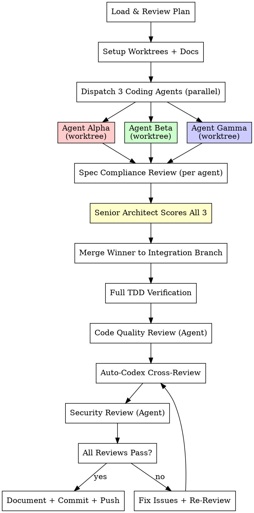

# Saturated Execution (execute-plans)

## Overview

**3 parallel coding agents implement the same plan independently in isolated git worktrees with TDD. A senior architect scores, selects, and merges the best. Auto-codex cross-review validates. Then ship.**

Enhanced from `superpowers:executing-plans` with multi-agent redundancy at every stage.

## When to Use

- Implementation plan exists (from `write-plans` or provided by user)
- User says "execute with agent team", "饱和式执行", "best-of-3 implement"
- High-confidence implementation needed

## The 7-Phase Process



---

## Phase 0: Load & Review Plan

1. Read the plan file (from `write-plans` output or user-provided)
2. Review critically — identify any questions or concerns
3. If concerns: raise with user before starting
4. If no concerns: proceed

**STOP if:**
- Plan has critical gaps
- Instructions are unclear
- Missing dependency information

**Ask for clarification rather than guessing.**

---

## Phase 1: Setup

### 1.1 Create Git Worktrees

```bash
git check-ignore -q .worktrees 2>/dev/null || echo ".worktrees/" >> .gitignore
BRANCH=$(git rev-parse --abbrev-ref HEAD)
git worktree add .worktrees/sat-alpha -b sat-impl-alpha $BRANCH
git worktree add .worktrees/sat-beta -b sat-impl-beta $BRANCH
git worktree add .worktrees/sat-gamma -b sat-impl-gamma $BRANCH
```

### 1.2 Initialize Documentation

```
claude_docs/saturation-run-{TIMESTAMP}/
├── requirements.md          # Plan + context for all agents
├── progress.md              # Overall progress tracker
├── agent-alpha/
│   └── implementation.md    # Alpha's approach, TDD log
├── agent-beta/
│   └── implementation.md    # Beta's approach, TDD log
├── agent-gamma/
│   └── implementation.md    # Gamma's approach, TDD log
├── architect-review.md      # Comparative analysis
└── final-review.md          # All review results
```

---

## Phase 2: Parallel Implementation

Dispatch 3 agents IN PARALLEL. Each uses `isolation: "worktree"`.

Use `./agent-prompt-template.md` for the full prompt. Each agent:
- Receives the FULL plan with all tasks
- Follows TDD strictly (RED-GREEN-REFACTOR for every step)
- Works independently in isolated worktree
- Documents approach in `claude_docs/agent-{name}/implementation.md`
- Commits work with descriptive messages

### Per-Agent Quality Gate

Each agent MUST:
- [ ] Write tests FIRST for every task (TDD Iron Law)
- [ ] All tests pass
- [ ] Code committed to their branch
- [ ] Documentation written in `claude_docs/`
- [ ] Self-assessment score (1-10) provided

**Disqualify** any agent that fails TDD or has failing tests.

---

## Phase 3: Spec Compliance Review (Per Agent)

After each agent completes, dispatch a **Spec Reviewer** for each:

```python
Agent(
    description="Review Alpha's spec compliance",
    prompt="""
    You are a spec compliance reviewer.
    Plan: {PLAN_FILE_PATH}
    Implementation: .worktrees/sat-alpha/
    Docs: claude_docs/saturation-run-{TIMESTAMP}/agent-alpha/implementation.md

    Check:
    - [ ] ALL plan tasks implemented (no skipped tasks)
    - [ ] Implementation matches spec (not over/under-built)
    - [ ] Tests cover all specified behaviors
    - [ ] No scope creep (features not in plan)
    - [ ] Documentation is complete

    Output: COMPLIANT / NON-COMPLIANT + specific issues
    """,
    model="opus"
)
```

Dispatch all 3 spec reviews in PARALLEL.

**If non-compliant:** Agent must fix issues before proceeding to architect review.

---

## Phase 4: Senior Architect Review

Dispatch architect agent (see `./architect-review-template.md`).

### Scoring Rubric (100 points)

| Criterion | Weight | Measures |
|-----------|--------|----------|
| Correctness | 30% | Tests pass, spec compliance, edge cases |
| Code Quality | 25% | Clean, readable, well-structured |
| Test Coverage | 20% | Coverage %, TDD evidence, test quality |
| Performance | 10% | Efficient algorithms, data structures |
| Security | 10% | No vulnerabilities, input validation |
| Simplicity | 5% | YAGNI, minimal abstractions |

### Selection (see `./merge-strategy.md`)

| Scenario | Action |
|----------|--------|
| Clear winner (>10 pt lead) | Merge as-is |
| Close race (<10 pt gap) | Maintainability tiebreaker |
| All <60 | Reject all, re-examine plan |

---

## Phase 5: Merge & Verify

### 5.1 Merge Winner

```bash
git checkout -b sat-integration $BRANCH
git merge sat-impl-{winner} --no-ff -m "feat: merge {winner} ({score}/100)"
```

### 5.2 Full TDD Verification

```bash
pytest --cov --cov-report=term-missing  # or project-appropriate test command
```

ALL tests must pass. Coverage must be >= 80% on new code.

### 5.3 Code Quality Review

Dispatch a `code-reviewer` agent on the merged code:
- Review code quality, naming, structure
- Check for code duplication
- Verify error handling patterns
- Ensure immutable data patterns

If issues found → fix and re-review.

---

## Phase 6: Cross-Review Gauntlet

This is the **saturation review** — multiple independent reviews, each catching different issues.

### 6.1 Auto-Codex Review

**REQUIRED:** Invoke `auto-codex-review` skill.
- Collect changed files (git diff against base)
- Run Codex review (structured JSON)
- Fix P0/P1 issues
- Re-review until PASS (max 5 rounds)

### 6.2 Security Review

Dispatch `security-reviewer` agent:
- No hardcoded secrets
- All inputs validated
- No injection vectors
- OWASP Top 10 compliance

### 6.3 Python Review (if Python project)

Dispatch `python-reviewer` agent:
- PEP 8 compliance
- Type hints coverage
- Pythonic idioms
- Security patterns

### 6.4 Final Verification

**REQUIRED SUB-SKILL:** `superpowers:verification-before-completion`

Before claiming done:
- [ ] ALL tests pass (run them, don't assume)
- [ ] Coverage >= 80% on new code
- [ ] Auto-codex review: PASS
- [ ] Security review: PASS
- [ ] No TODO/FIXME in new code
- [ ] Documentation complete in `claude_docs/`

---

## Phase 7: Document + Ship

### 7.1 Write Progress Document

```markdown
# Saturation Run: {Feature Name}
**Date:** YYYY-MM-DD
**Status:** COMPLETE
**Plan Source:** claude_docs/saturation-run-{TIMESTAMP}/final-plan.md

## Results
- Agents: 3 (Alpha, Beta, Gamma)
- Winner: {name} ({score}/100)
- Runner-up: {name} ({score}/100)
- Reviews: auto-codex ({N} rounds), security (PASS), code quality (PASS)
- Coverage: {X}%

## Files Modified
{list}

## Review Summary
| Review | Result | Issues Fixed |
|--------|--------|-------------|
| Spec Compliance | PASS | 0 |
| Architect Review | Alpha wins (89/100) | N/A |
| Code Quality | PASS | 2 |
| Auto-Codex | PASS (2 rounds) | 5 |
| Security | PASS | 0 |
```

### 7.2 Git Commit & Push

```bash
git add -A
git commit -m "feat: {description} (saturated-team, best-of-3, {score}/100)

Plan: saturated planning (best-of-{N})
Agents: Alpha ({s1}), Beta ({s2}), Gamma ({s3})
Winner: {name}
Reviews: auto-codex PASS, security PASS, code-quality PASS
Coverage: {X}%

Co-Authored-By: Claude Opus 4.6 <noreply@anthropic.com>"

git push origin sat-integration
```

### 7.3 Clean Up

```bash
git worktree remove .worktrees/sat-alpha
git worktree remove .worktrees/sat-beta
git worktree remove .worktrees/sat-gamma
git branch -D sat-impl-alpha sat-impl-beta sat-impl-gamma
```

### 7.4 Branch Integration

Use `superpowers:finishing-a-development-branch` to decide:
- Merge to main directly
- Create PR for team review
- Keep on integration branch

---

## Red Flags — STOP

- Agent completed without tests → Disqualify
- All 3 scored below 60 → Re-examine plan
- Merge creates test failures → Fix before proceeding
- Auto-codex found P0 security issue → Fix immediately
- Agent didn't write docs → Resume and require
- Any review blocked → Do NOT ship

## Integration

**REQUIRED SUB-SKILLS:**
- `superpowers:test-driven-development` — TDD for each agent
- `superpowers:using-git-worktrees` — Worktree safety
- `auto-codex-review` — Cross-review gate
- `superpowers:verification-before-completion` — Final verification
- `superpowers:finishing-a-development-branch` — Branch cleanup

**AGENTS USED:**
- `everything-claude-code:tdd-guide` — TDD enforcement
- `everything-claude-code:code-reviewer` — Code quality
- `everything-claude-code:security-reviewer` — Security gate
- `everything-claude-code:architect` — Architecture decisions
- `everything-claude-code:python-reviewer` — Python quality (if applicable)
- `superpowers:code-reviewer` — Major step review
