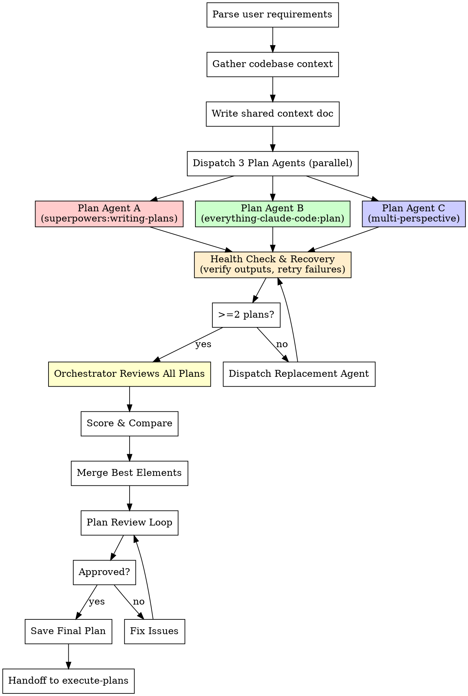

# Saturated Planning (write-plans)

## Overview

**Multiple agents write plans in parallel, then the orchestrator reviews and merges into one superior plan.**

Instead of relying on a single planning pass, dispatch **exactly 3** independent planning agents — each using different planning skills/approaches — then act as the Senior Reviewer to select and synthesize the best elements. Includes health monitoring, timeout recovery, and replacement dispatch to guarantee reliable completion.

## When to Use

- Requirements or spec exists, but no implementation plan yet
- Complex feature needing thorough planning
- User says "saturated plan", "饱和式 plan", "multi-agent plan"
- Before invoking `execute-plans`

## The Process



---

## Phase 1: Context Gathering

Before dispatching planners, gather comprehensive context:

```markdown
1. Read user requirements thoroughly
2. Explore codebase structure (key files, architecture, patterns)
3. Identify:
   - Files that will need modification
   - Existing patterns to follow
   - Dependencies and constraints
   - Test infrastructure available
4. Write context document: claude_docs/saturation-run-{TIMESTAMP}/planning-context.md
```

This context document is shared with ALL planning agents to ensure they plan against the real codebase, not assumptions.

---

## Phase 2: Parallel Plan Generation

### Dispatch Exactly 3 Planning Agents in Parallel (MANDATORY)

**You MUST dispatch all 3 agents.** No shortcuts. No "2 is enough." 3 agents provides the diversity needed for robust plan synthesis.

Each agent uses a DIFFERENT planning skill/approach for maximum diversity:

**Agent A — Using `superpowers:writing-plans` approach:**
```python
Agent(
    description="Plan Agent A: superpowers-style plan",
    prompt="""
    You are Plan Agent A in a saturated planning team.

    ## Requirements
    {FULL_REQUIREMENTS}

    ## Codebase Context
    {CONTEXT_DOC}

    ## Your Planning Approach
    Follow the superpowers:writing-plans methodology:
    - Map out file structure first
    - Bite-sized task granularity (2-5 min each step)
    - Every task has: failing test → run verify fail → implement → run verify pass → commit
    - Exact file paths, complete code in plan, exact commands with expected output
    - DRY, YAGNI, TDD, frequent commits

    ## Output
    Write your complete plan to: claude_docs/saturation-run-{TIMESTAMP}/plan-agent-a.md
    Use the standard plan document format with header, tasks, steps, checkboxes.

    ## Self-Assessment
    At the end, rate your plan 1-10 and explain strengths/weaknesses.
    """,
    run_in_background=True,
    model="opus"
)
```

**Agent B — Using `everything-claude-code:plan` approach:**
```python
Agent(
    description="Plan Agent B: ECC-style plan",
    prompt="""
    You are Plan Agent B in a saturated planning team.

    ## Requirements
    {FULL_REQUIREMENTS}

    ## Codebase Context
    {CONTEXT_DOC}

    ## Your Planning Approach
    Follow the everything-claude-code:plan methodology:
    - Restate requirements clearly
    - Assess risks and identify blockers
    - Create step-by-step implementation plan with risk mitigation
    - Focus on architecture decisions and trade-offs
    - Include rollback strategies

    ## Output
    Write your complete plan to: claude_docs/saturation-run-{TIMESTAMP}/plan-agent-b.md

    ## Self-Assessment
    At the end, rate your plan 1-10 and explain strengths/weaknesses.
    """,
    run_in_background=True,
    model="opus"
)
```

**Agent C (MANDATORY) — Using multi-perspective analysis approach:**
```python
Agent(
    description="Plan Agent C: multi-model collaborative plan",
    prompt="""
    You are Plan Agent C in a saturated planning team.

    ## Requirements
    {FULL_REQUIREMENTS}

    ## Codebase Context
    {CONTEXT_DOC}

    ## Your Planning Approach
    Use a multi-perspective analysis:
    - Analyze from security perspective first
    - Then from performance perspective
    - Then from maintainability perspective
    - Synthesize into a plan that balances all three
    - Include explicit risk matrix

    ## Output
    Write your complete plan to: claude_docs/saturation-run-{TIMESTAMP}/plan-agent-c.md

    ## Self-Assessment
    At the end, rate your plan 1-10 and explain strengths/weaknesses.
    """,
    run_in_background=True,
    model="opus"
)
```

---

## Phase 2.5: Agent Health Check & Recovery (MANDATORY)

After dispatching all 3 agents, **you MUST verify each agent completed successfully** before proceeding. Agents can silently fail, get stuck, or produce incomplete output.

### Completion Verification Checklist

For EACH agent (A, B, C), verify:
- [ ] Agent returned a result (did not error/timeout)
- [ ] Output plan file exists and is non-empty: `claude_docs/saturation-run-{TIMESTAMP}/plan-agent-{x}.md`
- [ ] Plan contains actual content (not just headers/boilerplate — check word count > 500)
- [ ] Self-assessment score is present at the end

### Recovery Protocol

| Failure | Action |
|---------|--------|
| Agent returned error | Dispatch a **replacement agent** with the same role and approach. Max 1 retry per slot. |
| Agent output file missing or empty | Same as error — dispatch replacement. |
| Agent output is incomplete (< 500 words, no self-assessment) | **Resume** the agent if possible (pass agent ID). If not resumable, dispatch replacement. |
| 2 of 3 agents failed | Dispatch 2 replacements in parallel. This is your last retry round. |
| All 3 agents failed | **STOP.** Report to user. Do NOT proceed with 0 plans. Investigate root cause (prompt too long? context too complex?). |

### Minimum Viable Results

- **Ideal:** 3 of 3 plans completed → full 3-way comparison
- **Acceptable:** 2 of 3 plans completed → proceed with 2-way comparison (after 1 retry round for the failed agent)
- **Unacceptable:** < 2 plans completed → STOP, do not proceed to review

**DO NOT skip this phase.** "All agents seemed to run" is not verification. Read the output files.

---

## Phase 3: Orchestrator Review & Merge

After all planning agents complete, the orchestrator (YOU) acts as Senior Reviewer:

### 3.1 Read All Plans

Read each plan document completely. For each plan, evaluate:

### 3.2 Plan Scoring Rubric

| Criterion | Weight | What to Look For |
|-----------|--------|-----------------|
| **Completeness** | 25% | All requirements covered, no gaps, no TODOs |
| **Task Decomposition** | 25% | Bite-sized steps, clear boundaries, testable milestones |
| **TDD Integration** | 20% | Every task starts with failing test, verification steps included |
| **Architecture Quality** | 15% | Clean file structure, single responsibility, follows codebase patterns |
| **Risk Awareness** | 15% | Edge cases identified, rollback strategies, dependency risks |

### 3.3 Comparison Matrix

Build a comparison table:

```markdown
## Plan Comparison

| Criterion (Weight) | Agent A | Agent B | Agent C |
|--------------------|---------|---------|---------|
| Completeness (25) | /25 | /25 | /25 |
| Task Decomposition (25) | /25 | /25 | /25 |
| TDD Integration (20) | /20 | /20 | /20 |
| Architecture Quality (15) | /15 | /15 | /15 |
| Risk Awareness (15) | /15 | /15 | /15 |
| **TOTAL** | /100 | /100 | /100 |

## Unique Strengths
- Agent A: {what this plan does better than others}
- Agent B: {what this plan does better than others}
- Agent C: {what this plan does better than others}
```

### 3.4 Merge Strategy

| Scenario | Action |
|----------|--------|
| Clear winner (>15 pt lead) | Use winner as base, cherry-pick unique strengths from others |
| Close scores (<15 pt gap) | Merge best elements from top 2 into a synthesized plan |
| All below 60 | Re-examine requirements, dispatch new planners with more context |

**Merge guidelines:**
- Take the **task decomposition** from the plan with best granularity
- Take the **architecture decisions** from the plan with best patterns
- Take the **risk analysis** from the most thorough plan
- Take the **TDD structure** from the plan with most rigorous test design
- Ensure NO contradictions exist in the merged result

### 3.5 Write Merged Plan

Save the merged plan to: `claude_docs/saturation-run-{TIMESTAMP}/final-plan.md`

The plan MUST follow this format:

```markdown
# {Feature Name} Implementation Plan

> **For agentic workers:** REQUIRED: Use saturated-agent-team-coding execute-plans workflow.
> This plan was generated via saturated planning (best-of-{N} agents).

**Goal:** {One sentence}
**Architecture:** {2-3 sentences}
**Tech Stack:** {Key technologies}
**Plan Source:** Merged from Agent {X} (base, {score}/100) + cherry-picks from Agent {Y}

---

### Task 1: {Component Name}

**Files:**
- Create: `exact/path/to/file.py`
- Test: `tests/exact/path/test_file.py`

- [ ] **Step 1: Write failing test**
{complete test code}

- [ ] **Step 2: Verify test fails**
Run: `{exact command}`
Expected: FAIL with "{expected error}"

- [ ] **Step 3: Implement**
{complete implementation code}

- [ ] **Step 4: Verify test passes**
Run: `{exact command}`
Expected: PASS

- [ ] **Step 5: Commit**
```bash
git add {files}
git commit -m "{message}"
```

### Task 2: ...
```

---

## Phase 4: Plan Review Loop

After writing the merged plan, dispatch a **Plan Reviewer Agent**:

```python
Agent(
    description="Review merged plan",
    prompt="""
    You are a plan document reviewer. Verify this plan is complete and ready
    for implementation by 3 parallel coding agents.

    Plan file: claude_docs/saturation-run-{TIMESTAMP}/final-plan.md
    Requirements: claude_docs/saturation-run-{TIMESTAMP}/planning-context.md

    Check:
    - [ ] All requirements covered (no gaps)
    - [ ] No TODOs or placeholders
    - [ ] Every task has TDD steps (test first → verify fail → implement → verify pass)
    - [ ] Exact file paths provided
    - [ ] Complete code provided (not "add validation" but actual code)
    - [ ] Exact commands with expected output
    - [ ] Tasks are independent enough for parallel agents
    - [ ] No contradictions between tasks

    Output: Status (Approved/Issues Found) + specific issues if any
    """,
    model="opus"
)
```

If issues found → fix and re-review (max 3 iterations).

---

## Phase 5: Handoff

After plan is approved:

1. Save plan review result to `claude_docs/saturation-run-{TIMESTAMP}/plan-review.md`
2. Present to user:

```
Plan complete and saved to claude_docs/saturation-run-{TIMESTAMP}/final-plan.md

Sources:
- Plan Agent A: {score}/100 ({brief strength})
- Plan Agent B: {score}/100 ({brief strength})
- Merged plan uses Agent {X} as base with cherry-picks from Agent {Y}
- Plan review: APPROVED

Ready to execute with saturated agent team? (execute-plans)
```

3. When user confirms → proceed to `execute-plans` workflow with the final plan as input.

---

## Documentation Output

```
claude_docs/saturation-run-{TIMESTAMP}/
├── planning-context.md       # Codebase context for planners
├── plan-agent-a.md           # Agent A's independent plan
├── plan-agent-b.md           # Agent B's independent plan
├── plan-agent-c.md           # Agent C's plan (if dispatched)
├── plan-comparison.md        # Orchestrator's scoring & comparison
├── final-plan.md             # Merged best-of-N plan
└── plan-review.md            # Review result
```
