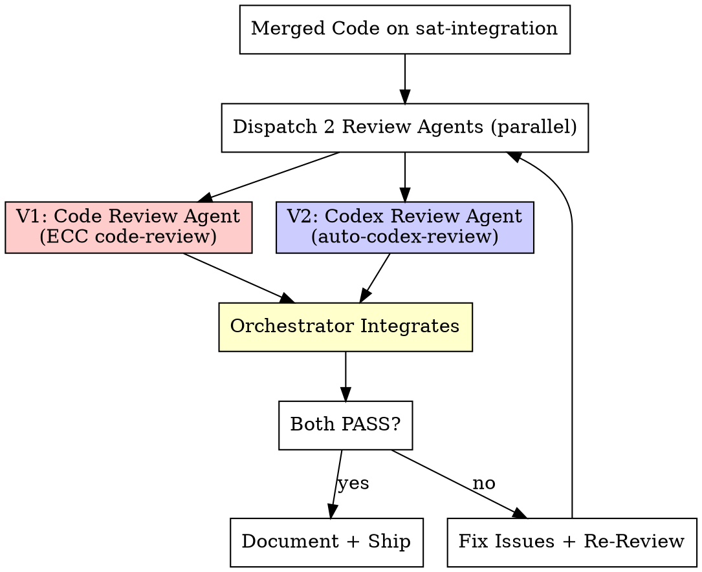

# Saturated Verification (Phase 4: verification)

## Overview

**2 parallel verification agents independently review the merged code using different methodologies.** One uses `everything-claude-code:code-review` for manual-style comprehensive review. The other uses `auto-codex-review` for automated Codex-powered review with fix loops. The orchestrator presents both results and routes the next action.

The orchestrator NEVER fixes code itself. It spawns reviewers, waits, integrates results, presents to user, routes fixes.

## When to Use

- After `/saturated-execute-plan` completes
- Code exists and needs quality assurance
- User says "saturated verify", "饱和式验证", "cross-verify"
- Before shipping / git push

## The Process



---

## Phase 1: Collect Review Context

Before dispatching reviewers, prepare the context:

```bash
# Get the diff of all changes
git diff main...sat-integration --stat
git diff main...sat-integration

# List all changed files
git diff main...sat-integration --name-only
```

Gather:
- Changed files list
- The full diff
- The implementation plan (for spec compliance checking)
- Test results and coverage from execute-plan phase

---

## Phase 2: Dispatch 2 Review Agents (PARALLEL)

### Agent V1: Code Review (everything-claude-code:code-review)

```python
Agent(
    description="V1: comprehensive code review",
    prompt="""
    You are Verification Agent V1: Comprehensive Code Reviewer.

    ## Your Methodology: everything-claude-code:code-review
    Perform a thorough code review covering:

    **Security Issues (CRITICAL):**
    - Hardcoded credentials, API keys, tokens
    - SQL injection, XSS, command injection vulnerabilities
    - Missing input validation
    - Path traversal risks
    - Insecure dependencies

    **Code Quality (HIGH):**
    - Functions > 50 lines
    - Files > 800 lines
    - Nesting depth > 4 levels
    - Missing error handling
    - Debug/console.log statements left in
    - TODO/FIXME comments in new code
    - Code duplication

    **Best Practices (MEDIUM):**
    - Mutation patterns (should use immutable instead)
    - Missing tests for new code
    - Test quality (testing behavior vs implementation)
    - Naming clarity and consistency
    - Single responsibility principle compliance

    ## Changed Files
    {CHANGED_FILES_LIST}

    ## Full Diff
    {FULL_DIFF}

    ## Implementation Plan (for spec compliance)
    {PLAN_SUMMARY}

    ## Output
    Write your review to: claude_docs/saturation-run-{TIMESTAMP}/code-review.md

    Format:
    ```markdown
    # Code Review: {Feature}
    **Reviewer:** V1 (ECC Code Review)
    **Verdict:** PASS / FAIL

    ## Issues Found
    | # | Severity | File:Line | Issue | Suggested Fix |
    |---|----------|-----------|-------|---------------|

    ## Spec Compliance
    - [ ] All requirements implemented
    - [ ] No scope creep
    - [ ] Tests cover specified behaviors

    ## Strengths
    - {what's done well}

    ## Summary
    CRITICAL: {n}, HIGH: {n}, MEDIUM: {n}, LOW: {n}
    Verdict: PASS (0 CRITICAL + 0 HIGH) / FAIL
    ```
    """,
    model="opus",
    run_in_background=True
)
```

### Agent V2: Auto-Codex Review (auto-codex-review)

```python
Agent(
    description="V2: automated Codex review loop",
    prompt="""
    You are Verification Agent V2: Automated Codex Reviewer.

    ## Your Methodology: auto-codex-review
    Run the automated Codex review loop:

    1. Collect changed source files (git diff)
    2. Call Codex for structured review (JSON: issues with P0/P1/P2 priority)
    3. Parse results
    4. If P0/P1 issues found: fix them and re-review (max 5 rounds)
    5. If PASS (no P0/P1): generate summary

    ## Process Details

    ### Code Collection
    - Get changed files: git diff main...sat-integration --name-only
    - Read each changed source file
    - NEVER include .env, secrets, credentials in review input

    ### Review Loop
    For each round:
    - Build prompt with all code + context + previously fixed issues
    - Get structured review (issues array with id, priority, title, description, fix)
    - Verdict: PASS = zero P0 + zero P1, FAIL = any P0 or P1
    - Fix ALL issues (P0, P1, P2) if FAIL
    - Run tests after each fix round
    - Track all rounds for summary

    ### Debate Protocol
    If you disagree with an issue (type system guarantees, framework contracts):
    - Write technical rebuttal with code evidence
    - Max 2 debate rounds per issue
    - If still disputed after 2 rounds, flag for user decision

    ## Changed Files
    {CHANGED_FILES_LIST}

    ## Output
    Write your review to: claude_docs/saturation-run-{TIMESTAMP}/codex-review.md

    Format:
    ```markdown
    # Codex Review: {Feature}
    **Reviewer:** V2 (Auto-Codex Review)
    **Verdict:** PASS / PARTIAL / FAIL
    **Rounds:** {n}

    ## Review Rounds
    ### Round 1
    Issues Found: X (P0: a, P1: b, P2: c)
    | ID | Priority | Issue | Fix Applied |

    ### Round N (Final)
    Issues Found: 0
    Verdict: PASS

    ## Disputed Issues
    | ID | Issue | Rebuttal | Resolution |

    ## Summary
    Total Rounds: N
    Total Issues Fixed: X
    ```
    """,
    model="opus",
    run_in_background=True
)
```

---

## Phase 2.5: Health Check (MANDATORY)

Verify BOTH agents completed:

- [ ] V1 returned result with review document
- [ ] V2 returned result with review document
- [ ] Both documents contain verdict (PASS/FAIL)

| Failure | Action |
|---------|--------|
| V1 failed | Dispatch replacement V1 agent |
| V2 failed | Dispatch replacement V2 agent |
| Both failed | STOP. Report to user. |

**Minimum:** Both agents must complete.

---

## Phase 3: Orchestrator Integration

### 3.1 Read Both Reviews

Read `code-review.md` and `codex-review.md` completely.

### 3.2 Cross-Reference Issues

Build a unified issue list:

```markdown
## Cross-Verification Results

### Issues Found by BOTH reviewers (HIGH CONFIDENCE)
| Issue | V1 Severity | V2 Priority | Status |

### Issues Found ONLY by V1 (Code Review)
| Issue | Severity | Status |

### Issues Found ONLY by V2 (Codex Review)
| Issue | Priority | Status |

### Disputed (V1 and V2 disagree)
| Issue | V1 says | V2 says | Resolution |
```

### 3.3 Decision Matrix

| V1 Verdict | V2 Verdict | Action |
|-----------|-----------|--------|
| PASS | PASS | Ship! Proceed to document + commit. |
| PASS | FAIL | Fix V2's P0/P1 issues, re-run V2 only. |
| FAIL | PASS | Fix V1's CRITICAL/HIGH issues, re-run V1 only. |
| FAIL | FAIL | Fix ALL issues, re-run both. Max 3 fix-review cycles. |

### 3.4 Fix Routing

When issues need fixing, the orchestrator:
1. Presents the unified issue list to the user
2. Dispatches a fix agent (NOT the orchestrator itself) to apply fixes
3. Re-runs the failing reviewer(s)
4. Repeats until PASS or max 3 cycles

---

## Phase 4: Document + Ship

After both reviewers PASS:

### 4.1 Write Final Report

Save to: `claude_docs/saturation-run-{TIMESTAMP}/final-report.md`

```markdown
# Saturation Run: {Feature Name}
**Date:** YYYY-MM-DD
**Status:** COMPLETE

## Pipeline Summary
| Phase | Agents | Result |
|-------|--------|--------|
| Research | 4 | Synthesized |
| Planning | 4 (2 methodologies) | Agent {X} base ({score}/100) |
| Execution | 4 (2 methodologies) | Agent {winner} wins ({score}/100) |
| Verification | 2 | PASS (code-review + codex-review) |

## Execution Results
| Agent | Methodology | Score | Notes |
|-------|-------------|-------|-------|
| Alpha | superpowers:executing-plans | {s1}/100 | |
| Beta | superpowers:executing-plans | {s2}/100 | |
| Gamma | ECC:tdd | {s3}/100 | |
| Delta | ECC:tdd | {s4}/100 | |

## Verification Results
| Review | Result | Issues Fixed |
|--------|--------|-------------|
| Code Review (V1) | PASS | {n} |
| Codex Review (V2) | PASS ({n} rounds) | {n} |

## Coverage
{X}%

## Files Modified
{list}
```

### 4.2 Git Commit

```bash
git add -A
git commit -m "$(cat <<'EOF'
feat: {description} (saturated-coding, best-of-4, {score}/100)

Pipeline: research(4) -> plan(4) -> execute(4) -> verify(2)
Methodologies: superpowers:executing-plans + ECC:tdd
Winner: Agent {name} ({score}/100)
Verification: code-review PASS, codex-review PASS ({n} rounds)
Coverage: {X}%

Co-Authored-By: Claude Opus 4.6 <noreply@anthropic.com>
EOF
)"
```

### 4.3 Present to User

```
Saturated Coding pipeline complete!

Phase 1 (Research): 4 agents investigated stack, solutions, architecture, risks
Phase 2 (Planning): 4 agents created plans (2 methodologies), merged best-of-4
Phase 3 (Execution): 4 agents implemented (2 methodologies), winner: {name} ({score}/100)
Phase 4 (Verification): 2 agents cross-verified (code-review + codex-review), both PASS

Result: {X}% coverage, {N} files modified, {N} total issues found and fixed

Ready to push? Options:
1. Push to sat-integration branch
2. Merge to main and push
3. Create PR for team review
```

### 4.4 Branch Cleanup (after user decides)

Use `superpowers:finishing-a-development-branch` to handle:
- Merge to main
- Create PR
- Keep on integration branch

Then clean up worktrees and branches (see execute-plan Phase 7).

---

## Red Flags — STOP

- Any CRITICAL security issue found by EITHER reviewer -> Fix immediately, do NOT ship
- V1 and V2 both find the same CRITICAL issue -> High confidence, prioritize fix
- 3 fix-review cycles and still failing -> Escalate to user
- Coverage dropped below 80% -> Fix before shipping
