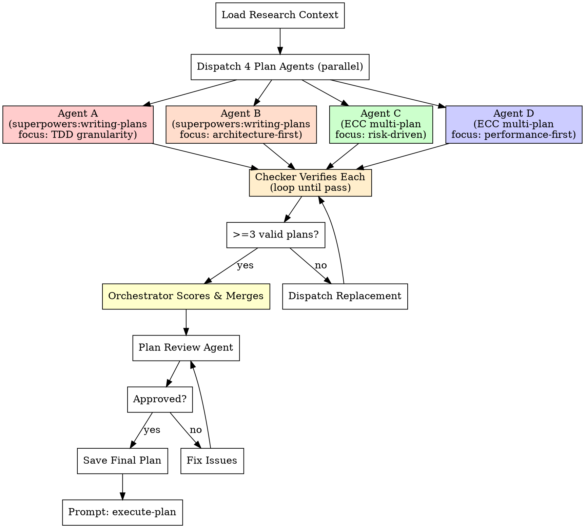

# Saturated Planning (Phase 2: write-plan)

## Overview

**4 agents write plans in parallel using 2 different planning methodologies, then the orchestrator reviews, scores, and merges into one superior plan.**

- **Agents A & B** use `superpowers:writing-plans` methodology (bite-sized TDD tasks, exact file paths, exact commands)
- **Agents C & D** use `everything-claude-code:multi-plan` methodology (multi-perspective analysis, context retrieval, cross-validation)

Each agent independently generates a complete implementation plan. A checker verifies each plan. The orchestrator compares, selects, and merges the best elements.

## When to Use

- Requirements/spec exist but no implementation plan yet
- Complex feature needing thorough planning
- User says "saturated plan", "饱和式 plan", "write-plan"
- After `/saturated-coding:research` completes

## The Process



---

## Phase 1: Context Preparation

Before dispatching planners, prepare comprehensive context:

1. Read research output (from `/saturated-coding:research`) or user requirements
2. Explore codebase structure (key files, architecture, patterns)
3. Identify files that will need modification, existing patterns, dependencies
4. Write context document: `claude_docs/saturation-run-{TIMESTAMP}/planning-context.md`

This context is shared with ALL planning agents.

---

## Phase 2: Dispatch 4 Planning Agents (PARALLEL, MANDATORY)

**You MUST dispatch all 4 agents.** No shortcuts. 4 agents with 2 different methodologies provides the diversity needed for robust plan synthesis.

### Agent A — superpowers:writing-plans (TDD-first granularity)

```python
Agent(
    description="Plan Agent A: superpowers TDD-granular plan",
    prompt="""
    You are Plan Agent A in a saturated planning team of 4.
    Your plan will be compared against 3 others. Write the BEST plan you can.

    ## Requirements
    {FULL_REQUIREMENTS}

    ## Codebase Context
    {PLANNING_CONTEXT}

    ## Your Planning Methodology: superpowers:writing-plans (TDD-first)
    Follow this approach strictly:
    - Map out file structure first (which files to create/modify)
    - Bite-sized task granularity (each step = 2-5 minutes)
    - Every task structure: failing test -> run verify fail -> implement -> run verify pass -> commit
    - Exact file paths, complete code in plan, exact commands with expected output
    - DRY, YAGNI, TDD, frequent commits
    - Design units with clear boundaries and well-defined interfaces

    ## Your Differentiator: TDD Granularity
    Focus on making the TDD cycles as fine-grained and rigorous as possible.
    Each step should have a single test that tests a single behavior.
    The test code should be complete and runnable, not pseudocode.

    ## Output
    Write your complete plan to: claude_docs/saturation-run-{TIMESTAMP}/plan-agent-a.md

    Use the standard plan document format:
    - Header with Goal, Architecture, Tech Stack
    - Tasks with Files, Steps (test first -> verify fail -> implement -> verify pass -> commit)
    - Exact file paths, complete code, exact commands

    ## Self-Assessment
    At the end, rate your plan 1-10 on: completeness, granularity, TDD rigor, architecture, risk awareness.
    """,
    run_in_background=True,
    model="opus"
)
```

### Agent B — superpowers:writing-plans (architecture-first)

```python
Agent(
    description="Plan Agent B: superpowers architecture-first plan",
    prompt="""
    You are Plan Agent B in a saturated planning team of 4.
    Your plan will be compared against 3 others. Write the BEST plan you can.

    ## Requirements
    {FULL_REQUIREMENTS}

    ## Codebase Context
    {PLANNING_CONTEXT}

    ## Your Planning Methodology: superpowers:writing-plans (architecture-first)
    Follow the superpowers:writing-plans approach but lead with architecture:
    - Start with architectural analysis: what patterns exist, what interfaces are needed
    - Design the module/file decomposition FIRST, then derive tasks
    - Every task still follows TDD: failing test -> verify fail -> implement -> verify pass -> commit
    - Include rollback strategies per task
    - Exact file paths, complete code, exact commands

    ## Your Differentiator: Architecture Quality
    Focus on clean decomposition, interface design, and module boundaries.
    The architecture should be so clear that any engineer could pick up any task independently.

    ## Output
    Write your complete plan to: claude_docs/saturation-run-{TIMESTAMP}/plan-agent-b.md

    ## Self-Assessment
    At the end, rate your plan 1-10 on: completeness, granularity, TDD rigor, architecture, risk awareness.
    """,
    run_in_background=True,
    model="opus"
)
```

### Agent C — ECC multi-plan (risk-driven)

```python
Agent(
    description="Plan Agent C: ECC multi-plan risk-driven",
    prompt="""
    You are Plan Agent C in a saturated planning team of 4.
    Your plan will be compared against 3 others. Write the BEST plan you can.

    ## Requirements
    {FULL_REQUIREMENTS}

    ## Codebase Context
    {PLANNING_CONTEXT}

    ## Your Planning Methodology: Multi-Perspective Analysis (Risk-Driven)
    Use a comprehensive multi-perspective planning approach:
    1. Context retrieval: Read all relevant files, understand the codebase deeply
    2. Multi-angle analysis:
       - Security perspective: What could be exploited?
       - Reliability perspective: What could fail?
       - Maintainability perspective: What will be hard to change later?
    3. Risk-first task ordering: Tackle highest-risk items first
    4. Explicit risk matrix for each task
    5. Mitigation strategies and rollback plans

    ## Your Differentiator: Risk Awareness
    Lead with risks. Each task should explicitly state what could go wrong
    and how to recover. Order tasks so the riskiest parts are validated first.

    ## Output
    Write your complete plan to: claude_docs/saturation-run-{TIMESTAMP}/plan-agent-c.md

    Format: Step-by-step implementation plan with:
    - Task type classification (frontend/backend/fullstack)
    - Key files table (file | operation | description)
    - Risk matrix per task
    - Complete implementation steps with code
    - Verification commands

    ## Self-Assessment
    At the end, rate your plan 1-10 on: completeness, granularity, TDD rigor, architecture, risk awareness.
    """,
    run_in_background=True,
    model="opus"
)
```

### Agent D — ECC multi-plan (performance-first)

```python
Agent(
    description="Plan Agent D: ECC multi-plan performance-first",
    prompt="""
    You are Plan Agent D in a saturated planning team of 4.
    Your plan will be compared against 3 others. Write the BEST plan you can.

    ## Requirements
    {FULL_REQUIREMENTS}

    ## Codebase Context
    {PLANNING_CONTEXT}

    ## Your Planning Methodology: Multi-Perspective Analysis (Performance-First)
    Use a performance-driven planning approach:
    1. Deep context retrieval: Read all relevant code, profile current patterns
    2. Performance analysis first:
       - What are the hot paths?
       - What data structures are optimal?
       - What are the algorithmic complexity requirements?
    3. Cross-validate: security, correctness, maintainability
    4. Synthesize into a plan that balances all perspectives
    5. Include benchmarks/performance tests alongside unit tests

    ## Your Differentiator: Performance & Efficiency
    Each task should consider algorithmic efficiency.
    Include performance tests where relevant.
    Prefer efficient data structures and algorithms.

    ## Output
    Write your complete plan to: claude_docs/saturation-run-{TIMESTAMP}/plan-agent-d.md

    Format: Step-by-step implementation plan with:
    - Key files table
    - Implementation steps with complete code
    - Performance considerations per task
    - Benchmark/performance test steps where applicable

    ## Self-Assessment
    At the end, rate your plan 1-10 on: completeness, granularity, TDD rigor, architecture, risk awareness.
    """,
    run_in_background=True,
    model="opus"
)
```

---

## Phase 2.5: Checker Verification Loop (MANDATORY)

After each agent completes, a checker verifies the output. Loop until pass.

### Verification Checklist (per agent)

- [ ] Plan file exists and is non-empty
- [ ] Plan contains substantive content (> 800 words)
- [ ] All requirements are covered (no gaps)
- [ ] Tasks have step-by-step structure
- [ ] File paths are concrete (not "path/to/...")
- [ ] Code in plan is complete (not "add validation here")
- [ ] Self-assessment score is present

### Checker Agent

Dispatch a checker agent for each plan:

```python
Agent(
    description="Verify plan completeness",
    prompt="""
    You are a plan checker. Verify this plan is complete and implementable.

    Plan file: claude_docs/saturation-run-{TIMESTAMP}/plan-agent-{x}.md
    Requirements: claude_docs/saturation-run-{TIMESTAMP}/planning-context.md

    Check:
    - [ ] All requirements covered (map each requirement to a task)
    - [ ] No TODOs, placeholders, or "add X here"
    - [ ] Every task has concrete steps
    - [ ] File paths are real (check if referenced files exist in codebase)
    - [ ] Code snippets are syntactically valid
    - [ ] Commands have expected output specified
    - [ ] Self-assessment is present

    Output: PASS / FAIL + specific issues to fix.
    If FAIL, list EVERY issue with exact location in the plan.
    """,
    model="opus"
)
```

**If FAIL:** Resume the planning agent with the checker's feedback. Max 2 retries per agent.

### Minimum Viable Results

- **Ideal:** 4 of 4 plans verified PASS
- **Acceptable:** 3 of 4 plans verified PASS
- **Unacceptable:** < 3 plans → dispatch replacements, then STOP if still < 3

---

## Phase 3: Orchestrator Scoring & Merge

### 3.1 Read All Plans

Read each verified plan completely.

### 3.2 Scoring Rubric

| Criterion | Weight | What to Look For |
|-----------|--------|-----------------|
| **Completeness** | 20% | All requirements covered, no gaps, no TODOs |
| **Task Decomposition** | 20% | Bite-sized steps, clear boundaries, testable milestones |
| **TDD Integration** | 20% | Every task starts with failing test, verification steps included |
| **Architecture Quality** | 15% | Clean file structure, single responsibility, follows codebase patterns |
| **Risk Awareness** | 15% | Edge cases identified, rollback strategies, dependency risks |
| **Performance** | 10% | Efficient algorithms, data structures, no obvious bottlenecks |

### 3.3 Comparison Matrix

```markdown
## Plan Comparison

| Criterion (Weight) | Agent A | Agent B | Agent C | Agent D |
|--------------------|---------|---------|---------|---------|
| Completeness (20)  | /20     | /20     | /20     | /20     |
| Task Decomposition (20) | /20 | /20    | /20     | /20     |
| TDD Integration (20) | /20   | /20     | /20     | /20     |
| Architecture Quality (15) | /15 | /15   | /15     | /15     |
| Risk Awareness (15) | /15    | /15     | /15     | /15     |
| Performance (10)   | /10     | /10     | /10     | /10     |
| **TOTAL**          | /100    | /100    | /100    | /100    |

## Unique Strengths
- Agent A (superpowers/TDD): {what this plan does best}
- Agent B (superpowers/arch): {what this plan does best}
- Agent C (ECC/risk): {what this plan does best}
- Agent D (ECC/perf): {what this plan does best}
```

Save to: `claude_docs/saturation-run-{TIMESTAMP}/plan-comparison.md`

### 3.4 Merge Strategy

| Scenario | Action |
|----------|--------|
| Clear winner (>15 pt lead) | Use winner as base, cherry-pick unique strengths from others |
| Close scores (<15 pt gap between top 2) | Merge best elements from top 2 |
| Top 2 tied, different methodologies | Prefer superpowers-style (better TDD granularity) as base |
| All below 60 | Re-examine requirements, dispatch new planners with more context |

**Merge guidelines:**
- Take **task decomposition** from the plan with finest granularity
- Take **architecture decisions** from the plan with cleanest module boundaries
- Take **risk analysis** from the most thorough plan (likely Agent C)
- Take **performance considerations** from Agent D
- Take **TDD structure** from the plan with most rigorous test design
- Ensure NO contradictions in the merged result

### 3.5 Write Merged Plan

Save to: `claude_docs/saturation-run-{TIMESTAMP}/final-plan.md`

Format:
```markdown
# {Feature Name} Implementation Plan

> **For agentic workers:** Use /saturated-coding:execute-plan to implement this plan.
> Generated via saturated planning (best-of-4 agents, 2 methodologies).

**Goal:** {One sentence}
**Architecture:** {2-3 sentences}
**Tech Stack:** {Key technologies}
**Plan Source:** Merged from Agent {X} (base, {score}/100) + cherry-picks from {Y}, {Z}

---

### Task 1: {Component Name}
**Files:**
- Create: `exact/path/to/file.py`
- Test: `tests/exact/path/test_file.py`

- [ ] **Step 1: Write failing test**
{complete test code}

- [ ] **Step 2: Verify test fails**
Run: `{exact command}`
Expected: FAIL with "{expected error}"

- [ ] **Step 3: Implement**
{complete implementation code}

- [ ] **Step 4: Verify test passes**
Run: `{exact command}`
Expected: PASS

- [ ] **Step 5: Commit**
git add {files}
git commit -m "{message}"

### Task 2: ...
```

---

## Phase 4: Plan Review Agent

Dispatch a review agent on the merged plan:

```python
Agent(
    description="Review merged plan for completeness",
    prompt="""
    Verify this merged plan is complete and ready for 4 parallel coding agents.

    Plan: claude_docs/saturation-run-{TIMESTAMP}/final-plan.md
    Requirements: claude_docs/saturation-run-{TIMESTAMP}/planning-context.md

    Check:
    - [ ] All requirements covered (no gaps)
    - [ ] No TODOs or placeholders
    - [ ] Every task has TDD steps
    - [ ] Exact file paths provided
    - [ ] Complete code provided
    - [ ] Exact commands with expected output
    - [ ] Tasks are independent enough for parallel agents
    - [ ] No contradictions between tasks

    Output: APPROVED / ISSUES FOUND + specific issues
    """,
    model="opus"
)
```

If issues found: fix and re-review (max 3 iterations).

---

## Phase 5: Handoff

After plan is approved, present to user:

```
Plan complete and saved to claude_docs/saturation-run-{TIMESTAMP}/final-plan.md

Sources:
- Plan Agent A (superpowers/TDD): {score}/100
- Plan Agent B (superpowers/arch): {score}/100
- Plan Agent C (ECC/risk): {score}/100
- Plan Agent D (ECC/perf): {score}/100
- Base: Agent {X} with cherry-picks from {Y}, {Z}
- Plan review: APPROVED

Ready to execute with 4 parallel coding agents?
→ /saturated-coding:execute-plan
```

---

## Documentation Output

```
claude_docs/saturation-run-{TIMESTAMP}/
├── planning-context.md          # Codebase context for planners
├── plan-agent-a.md              # Agent A: superpowers/TDD plan
├── plan-agent-b.md              # Agent B: superpowers/arch plan
├── plan-agent-c.md              # Agent C: ECC/risk plan
├── plan-agent-d.md              # Agent D: ECC/perf plan
├── plan-comparison.md           # Scoring & comparison matrix
├── final-plan.md                # Merged best-of-4 plan
└── plan-review.md               # Review result
```
